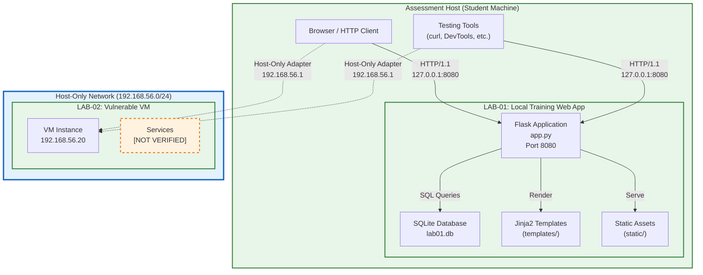

# LAB-01 — Authorized Vulnerable Web Application Security Lab

[](https://python.org)
[](https://flask.palletsprojects.com)
[](LICENSE)
[]()

> **⚠️ AUTHORIZED TRAINING ENVIRONMENT ONLY**  
> This is an intentionally vulnerable Flask application for **authorized cybersecurity training** within the RabTech Academy Task 02 scope. It must **never** be exposed to the internet, container bridges (`0.0.0.0`), or any network beyond the isolated localhost lab environment.

---

## 🎯 Purpose

This repository implements **RabTech Academy — Task 02: Legal Scope, Asset Inventory & Threat Model**. It provides:

1. **LAB-01**: An intentionally vulnerable Flask web application (`http://127.0.0.1:8080`) with 8 deliberate vulnerabilities mapped to STRIDE categories
2. **Complete documentation suite**: Authorization, asset inventory, architecture, data-flow diagrams, trust boundaries, STRIDE threat model, Rules of Engagement, testing methodology, evidence handling, and reporting templates
3. **Reproducible local setup** for controlled vulnerability validation
4. **Professional assessment artifacts** suitable as a single RabTech proof link

---

## 📋 Scope

### Authorized Assets

| Asset ID | Name | Environment | Address | Testing |
|----------|------|-------------|---------|---------|
| **LAB-01** | Local training web app | Isolated localhost | `http://127.0.0.1:8080` | Manual, low-rate, non-destructive |
| **LAB-02** | Deliberately vulnerable VM | Private host-only network | `192.168.56.20` | Manual, low-rate, non-destructive (conditional) |

### Explicitly Out of Scope
- ❌ College/university networks
- ❌ Public internet targets
- ❌ GitHub.com (publication only, not testing)
- ❌ Personal devices or third-party systems
- ❌ Denial of service / load testing
- ❌ Automated scanning / credential stuffing
- ❌ Persistence / outbound traffic / pivoting

---

## 🏗️ Architecture



**Key Boundaries**:
- **TB-01**: Browser ↔ Flask (localhost loopback)
- **TB-02**: Host ↔ LAB-02 (host-only network)
- **TB-03**: Flask ↔ SQLite (in-process)
- **TB-04**: User Input → Application (no validation)
- **TB-05**: Application → Privileged Functions (no authz)

[📄 Full Architecture Document](docs/architecture.md) | [📄 Trust Boundaries](docs/trust-boundaries.md)

---

## 🔐 Security Model

| Control | Implementation |
|---------|----------------|
| **Network Isolation** | LAB-01 binds `127.0.0.1:8080` only; LAB-02 on host-only `192.168.56.0/24` |
| **No Internet Access** | No NAT, no bridged networking, no external routing |
| **Trust Boundaries** | 5 documented boundaries (TB-01 through TB-05) |
| **Evidence Classification** | Confidential Training Evidence — redacted, retained per policy |
| **Testing Rules** | Manual, low-rate, non-destructive, scope-bound |

---

## 🐛 Deliberate Vulnerabilities (LAB-01)

| # | Route | Vulnerability | STRIDE | Priority | Dossier Ref |
|---|-------|---------------|--------|----------|-------------|
| 1 | `POST /login` | SQL Injection (string concat) | Tampering / Spoofing | High | §4.1 Row 1 |
| 2 | `GET /profile/<id>` | IDOR (no ownership check) | Tampering / Info Disc. | High | §4.1 Row 2 |
| 3 | `GET /search?q=` | Reflected XSS (`\|safe`) | Info Disclosure / Tampering | Medium | §4.1 Row 3 |
| 4 | `POST /comments` | Stored XSS (`\|safe`) | Tampering / Info Disc. | High | §4.1 Row 4 |
| 5 | `GET /admin` | Broken Authz (no role check) | Elevation of Privilege | Critical | §4.1 Row 5 |
| 6 | App-wide | Debug Mode (`debug=True`) | Information Disclosure | Medium | §4.1 Row 6 |
| 7 | Database | Plaintext Passwords | Info Disclosure / Spoofing | High | §4.1 Row 7 |
| 8 | Session | Static Secret Key | Spoofing / Tampering | High | §4.1 Row 8 |

**Seeded Accounts** (training data, plaintext on purpose):
| Username | Password | Role |
|----------|----------|------|
| `admin` | `admin123` | admin |
| `alice` | `alice123` | user |
| `bob` | `bob123` | user |

---

## 🛡️ STRIDE Threat Model Summary

| Threat ID | Component | STRIDE | Severity | Key Mitigation |
|-----------|-----------|--------|----------|----------------|
| T-001 | `POST /login` | Tampering | High | Parameterized queries |
| T-002 | `GET /profile/<id>` | Tampering | High | Ownership check |
| T-003 | `GET /search` | Info Disclosure | Medium | Remove `\|safe`, CSP |
| T-004 | `POST /comments` | Tampering | High | Remove `\|safe`, CSP |
| T-005 | `GET /admin` | Elev. of Privilege | Critical | Role check (`admin`) |
| T-006 | App-wide | Info Disclosure | Medium | `debug=False` |
| T-007 | Database | Info Disclosure | High | bcrypt password hashing |
| T-008 | Session | Spoofing | High | `SECRET_KEY` from env |

[📄 Full STRIDE Register](threat-model/stride-register.md) | [📄 Threat Prioritization](threat-model/threat-prioritization.md) | [📄 Remediation Guide](docs/remediation-guide.md)

---

## 🚀 Quick Start

### Prerequisites
- Python 3.11+
- Git
- VirtualBox/VMware (for LAB-02 host-only network)

### Setup

```bash
# Clone repository
git clone https://github.com/Sagarmankar123/lab01-web-app.git
cd lab01-web-app

# Create virtual environment
python -m venv venv

# Activate
# Windows:
venv\Scripts\activate
# Linux/macOS:
source venv/bin/activate

# Install dependencies
pip install -r requirements.txt

# Initialize database (seeds accounts)
python -c "from app import init_db; init_db()"

# Run application
python app.py
```

### Access
Open browser to: **`http://127.0.0.1:8080`**

### Reset Lab
Visit `http://127.0.0.1:8080/reset-lab` to restore database to seeded state.

---

## 🧪 Testing Methodology

All testing follows the **Rules of Engagement** ([`docs/rules-of-engagement.md`](docs/rules-of-engagement.md)):

- ✅ Manual, low-rate, controlled, non-destructive
- ✅ Restricted to LAB-01 and LAB-02 only
- ✅ Minimum necessary evidence capture
- ✅ Immediate stop on defined conditions

### Test Lifecycle
```text
Scope Verification → Reconnaissance → Attack Surface Mapping → Controlled Validation
        ↓
Evidence Capture → Risk Analysis → Remediation Recommendation → Retest → Report
```

[📄 Testing Methodology](docs/testing-methodology.md) | [📄 Test Plan](testing/test-plan.md) | [📄 Test Results](testing/test-results.md)

---

## 📁 Repository Structure

```
lab01-web-app/
│
├── README.md                 # This file — project landing page
├── LICENSE                   # MIT License
├── .gitignore                # Python/Flask exclusions
├── requirements.txt          # Flask<3.1,>=2.3
├── app.py                    # Intentionally vulnerable Flask app
│                             # (lab01.db generated at runtime — gitignored)
│
├── templates/                # Jinja2 templates (8 routes)
│   ├── base.html
│   ├── home.html
│   ├── login.html
│   ├── dashboard.html
│   ├── profile.html
│   ├── search.html
│   ├── comments.html
│   └── admin.html
│
├── static/
│   └── style.css             # Dark theme CSS
│
├── docs/                     # Core documentation
│   ├── authorization.md
│   ├── asset-inventory.md
│   ├── architecture.md
│   ├── data-flow.md
│   ├── trust-boundaries.md
│   ├── rules-of-engagement.md
│   ├── testing-methodology.md
│   ├── remediation-guide.md
│   └── completion-checklist.md
│
├── diagrams/                 # Architecture diagrams (SVG)
│   ├── architecture.svg      # System architecture diagram
│   ├── data-flow.svg         # Data-flow diagram
│   └── trust-boundaries.svg  # Trust boundary diagram
│
├── threat-model/             # STRIDE artifacts
│   ├── stride-register.md
│   └── threat-prioritization.md
│
├── testing/                  # Test artifacts
│   ├── test-plan.md
│   └── test-results.md
│
├── findings/                 # Finding reports
│   ├── README.md
│   └── finding-template.md
│
├── evidence/                 # Evidence storage
│   ├── README.md
│   ├── .gitkeep
│   └── raw/                  # Raw evidence (gitignored)
│       └── .gitkeep
│
└── secure-examples/          # Remediation examples (educational)
    └── (secure implementations)
```

---

## 📚 Documentation Index

| Document | Purpose |
|----------|---------|
| [`docs/authorization.md`](docs/authorization.md) | Written authorization, scope, stop conditions |
| [`docs/asset-inventory.md`](docs/asset-inventory.md) | Asset register, purpose, attack surface |
| [`docs/architecture.md`](docs/architecture.md) | System architecture, components, trust boundaries |
| [`docs/data-flow.md`](docs/data-flow.md) | Data flows, trust boundaries, evidence path |
| [`docs/trust-boundaries.md`](docs/trust-boundaries.md) | 5 trust boundaries with analysis |
| [`docs/rules-of-engagement.md`](docs/rules-of-engagement.md) | Permitted techniques, exclusions, stop conditions, evidence, reporting |
| [`docs/testing-methodology.md`](docs/testing-methodology.md) | 9-phase testing lifecycle, validation procedures |
| [`docs/remediation-guide.md`](docs/remediation-guide.md) | Per-vulnerability fixes with secure code examples |
| [`docs/completion-checklist.md`](docs/completion-checklist.md) | Task 02 requirement tracking |
| [`threat-model/stride-register.md`](threat-model/stride-register.md) | 8 threats with STRIDE mapping & source references |
| [`threat-model/threat-prioritization.md`](threat-model/threat-prioritization.md) | Ranked threats with rationale & retest objectives |
| [`testing/test-plan.md`](testing/test-plan.md) | 8 controlled validation tests + evidence requirements |
| [`testing/test-results.md`](testing/test-results.md) | Execution results (initially NOT EXECUTED) |
| [`findings/finding-template.md`](findings/finding-template.md) | Standardized 13-field finding report template |
| [`findings/README.md`](findings/README.md) | Finding lifecycle, naming, cross-references |
| [`evidence/README.md`](evidence/README.md) | Evidence handling, redaction, retention, custody |

---

## 🔒 Evidence & Reporting

- **Evidence**: Stored in `evidence/` (redacted) and `evidence/raw/` (gitignored)
- **Redaction**: Passwords, sessions, tokens, PII, debugger PINs → `[REDACTED]`
- **Finding Template**: 13-field structure in `findings/finding-template.md`
- **Retention**: Raw evidence deleted per policy; processed retained for academic record

---

## 🛠️ Remediation (Educational)

Secure implementations demonstrating fixes are in `secure-examples/`:

- Parameterized SQL queries
- Role-based access control (`@require_role`)
- Ownership checks for user resources
- Removal of `\|safe` filters + CSP headers
- bcrypt password hashing
- Environment-based secret management
- Debug mode disabled + custom error pages

> **Note**: The vulnerable `app.py` is **preserved intentionally** for training validation. Secure examples are for comparison only.

---

## ⚠️ Safety & Scope Reminders

| Rule | Enforcement |
|------|-------------|
| **Never expose publicly** | App binds `127.0.0.1` only; no `0.0.0.0` |
| **No external testing** | RoE prohibits third-party targets |
| **No automation** | Manual only; ≤10 req/min |
| **No persistence** | Lab resets via `/reset-lab` |
| **Evidence control** | Redaction mandatory; raw evidence gitignored |
| **Authorization required** | Signed RoE + approved window before testing |

---

## ✅ RabTech Task 02 Deliverables Checklist

| Deliverable | Status | Location |
|-------------|--------|----------|
| [x] Written authorization | PARTIAL (template + placeholders) | `docs/authorization.md` |
| [x] Asset inventory | Complete | `docs/asset-inventory.md` |
| [x] Architecture | Complete | `docs/architecture.md` |
| [x] Data-flow diagram (SVG) | Complete | `diagrams/data-flow.svg` |
| [x] Trust boundaries (SVG) | Complete | `diagrams/trust-boundaries.svg` |
| [x] Architecture diagram (SVG) | Complete | `diagrams/architecture.svg` |
| [x] STRIDE threat model | Complete | `threat-model/stride-register.md` |
| [x] Threat prioritization | Complete | `threat-model/threat-prioritization.md` |
| [x] Rules of Engagement | PARTIAL (template + placeholders) | `docs/rules-of-engagement.md` |
| [x] Testing methodology | Complete | `docs/testing-methodology.md` |
| [x] Test plan | Complete | `testing/test-plan.md` |
| [ ] Test results | NOT EXECUTED (awaiting approved window) | `testing/test-results.md` |
| [x] Evidence handling | Complete | `evidence/README.md` |
| [x] Findings standard | Complete | `findings/finding-template.md` |
| [x] Remediation guide | Complete | `docs/remediation-guide.md` |
| [ ] Authorization signed | PENDING USER/OWNER INPUT | `docs/authorization.md` |
| [ ] Final review & submission | **Pending** | Student action required |

---

## 📄 License

This project is licensed under the MIT License — see [LICENSE](LICENSE) for details.

---

## 📬 Submission

**Public GitHub Repository**: https://github.com/Sagarmankar123/lab01-web-app

This repository serves as the **single RabTech proof link** for Task 02.

---

> **Remember**: This is a controlled educational environment. All vulnerabilities are deliberate and documented. Testing is authorized only within the defined scope, window, and Rules of Engagement. Never use these techniques against unauthorized targets.