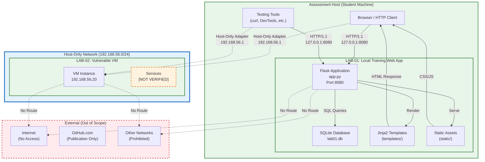

# System Architecture

## Overview

This document describes the system architecture for the RabTech Academy Task 02 authorized security lab. The architecture consists of an assessment host running two isolated training assets: LAB-01 (localhost web application) and LAB-02 (host-only network VM).

---

## Architecture Diagram

**SVG Diagram**: [`../diagrams/architecture.svg`](../diagrams/architecture.svg)



---

## Component Descriptions

### Assessment Host
The student's physical or virtual machine where testing is conducted. Contains:
- Web browser (primary testing interface)
- Command-line tools (curl, python, etc.)
- Git repository (this project)
- Virtualization software (VirtualBox/VMware) for LAB-02 host-only networking

### LAB-01: Local Training Web App
**Asset ID**: LAB-01  
**Binding**: `127.0.0.1:8080` (localhost only)  
**Framework**: Flask 3.0.x (Python)  
**Database**: SQLite 3 (file: `lab01.db`)  
**Templates**: Jinja2 (`templates/`)  
**Static Assets**: CSS (`static/style.css`)  

**Key Characteristics**:
- Intentionally vulnerable by design
- Debug mode enabled (`app.debug = True`)
- Static session secret (`lab01-static-secret-key`)
- No HTTPS (HTTP only, localhost)
- No authentication bypass protection beyond deliberate flaws

**Routes**:
| Route | Methods | Purpose |
|-------|---------|---------|
| `/` | GET | Home page |
| `/login` | GET, POST | Authentication (SQLi vulnerable) |
| `/logout` | GET | Session termination |
| `/dashboard` | GET | Authenticated user dashboard |
| `/profile/<id>` | GET | User profile (IDOR vulnerable) |
| `/search` | GET | Search with reflected input (XSS vulnerable) |
| `/comments` | GET, POST | Comments with stored XSS |
| `/admin` | GET | Admin panel (broken authz) |
| `/reset-lab` | GET | Database reset utility |

### Host-Only Network Boundary
**Network**: `192.168.56.0/24` (VirtualBox/VMware host-only adapter)  
**Gateway**: `192.168.56.1` (host machine)  
**Isolation**: No NAT, no bridged networking, no internet access

This network boundary is a **trust boundary** — traffic cannot route to/from external networks.

### LAB-02: Deliberately Vulnerable VM
**Asset ID**: LAB-02  
**IP**: `192.168.56.20` (static or DHCP within host-only range)  
**Network Interface**: Host-only adapter only  
**Services**: NOT VERIFIED — specific ports, services, OS, and vulnerabilities are not documented in this assessment

**Confirmed Constraints**:
- No outbound internet connectivity
- No access to assessment host localhost (127.0.0.1)
- No access to other host-only VMs unless explicitly configured
- Testing limited to passive enumeration and authorized active testing

### Data Stores
| Store | Location | Content | Classification |
|-------|----------|---------|----------------|
| `lab01.db` | `D:\RabTeach\lab01-web-app\lab01.db` | Users, notes, comments (plaintext passwords) | Confidential training evidence |
| Session cookies | Browser memory | Flask signed session (HMAC with static key) | Confidential training evidence |
| Evidence files | `evidence/` directory | Screenshots, logs, captures | Confidential training evidence |

---

## Trust Boundaries

| Boundary | Description | Enforcement |
|----------|-------------|-------------|
| **TB-01**: Assessment Host → LAB-01 | Localhost loopback; same process space | OS network stack; Flask binding to 127.0.0.1 |
| **TB-02**: Assessment Host → Host-Only Network | Virtual network adapter | Hypervisor network isolation |
| **TB-03**: LAB-01 App → Database | In-process SQLite connection | Application logic (no parameterization in vulnerable routes) |
| **TB-04**: User Input → Application Processing | HTTP request parameters | None (deliberately absent for training) |
| **TB-05**: Application → Admin Functionality | Role check bypass | None (deliberately absent for training) |

See `docs/trust-boundaries.md` for detailed analysis.

---

## Testing Relationship

```text
Assessor (Student)
    │
    ├──► LAB-01: Direct HTTP to 127.0.0.1:8080
    │       └──► Database via application logic
    │
    └──► LAB-02: Network via host-only adapter (192.168.56.1)
            └──► [Services NOT VERIFIED]
```

**Critical**: No testing relationship exists between LAB-01 and LAB-02. They are separate, isolated assets with different network boundaries. Pivoting between them is prohibited by Rules of Engagement.