# Data Flow Diagram

## Overview

This document describes the data flows within the authorized lab environment for RabTech Academy Task 02. Data flows are shown for LAB-01 (primary) and LAB-02 (secondary, isolated).

---

## LAB-01 Data Flow Diagram

**SVG Diagram**: [`../diagrams/data-flow.svg`](../diagrams/data-flow.svg)

```mermaid
flowchart TD
    subgraph Assessor ["Assessor / Browser"]
        User["Assessor\n(Human)"]
        Browser["Browser / HTTP Client"]
    end

    subgraph LAB01_App ["LAB-01: Flask Application (127.0.0.1:8080)"]
        direction TB
        Router["URL Router\n(app.py routes)"]
        
        subgraph Auth ["Authentication Flow"]
            LoginForm["Login Form\n(username, password)"]
            SQLBuilder["String-built SQL\nVULN: SQL Injection"]
        end
        
        subgraph Profile ["Profile Access Flow"]
            ProfileRoute["/profile/<id>\nVULN: IDOR"]
            ProfileQuery["Parameterized Query\nSELECT * FROM users WHERE id = ?"]
        end
        
        subgraph Search ["Search Flow"]
            SearchForm["Search Form\n(q parameter)"]
            Reflect["Direct Reflection\nVULN: Reflected XSS (|safe)"]
        end
        
        subgraph Comments ["Comments Flow"]
            CommentForm["Comment Form\n(author, content)"]
            CommentInsert["Parameterized INSERT\n(Safe)"]
            CommentRender["Render with |safe\nVULN: Stored XSS"]
        end
        
        subgraph Admin ["Admin Flow"]
            AdminRoute["/admin\nVULN: Missing Role Check"]
            AdminQuery["SELECT * FROM users\n(Plaintext passwords)"]
        end
        
        subgraph Error ["Error Handling"]
            DebugMode["debug = True\nVULN: Stack Traces"]
        end
    end

    subgraph Database ["SQLite Database (lab01.db)"]
        UsersTable["users table\nid, username, password(plaintext), role, email"]
        NotesTable["notes table\nid, user_id, content"]
        CommentsTable["comments table\nid, author, content"]
    end

    subgraph Evidence ["Evidence Collection"]
        Screenshots["Screenshots\n(Redacted)"]
        Logs["Request/Response Logs\n(Redacted)"]
        Notes["Assessment Notes"]
    end

    %% Flows
    User -->|Interacts| Browser
    Browser -->|HTTP Request| Router
    
    %% Auth Flow
    Router -->|POST /login| LoginForm
    LoginForm -->|Raw Input| SQLBuilder
    SQLBuilder -->|Concatenated Query| UsersTable
    UsersTable -->|Row or None| SQLBuilder
    SQLBuilder -->|Session Cookie| Browser
    
    %% Profile Flow
    Router -->|GET /profile/<id>| ProfileRoute
    ProfileRoute -->|Session Check Only| ProfileQuery
    ProfileQuery -->|User Row| UsersTable
    ProfileQuery -->|Notes| NotesTable
    ProfileRoute -->|Profile Data| Browser
    
    %% Search Flow
    Router -->|GET /search?q=| SearchForm
    SearchForm -->|Raw Query| Reflect
    Reflect -->|Unescaped Output| Browser
    
    %% Comments Flow
    Router -->|POST /comments| CommentForm
    CommentForm -->|Params| CommentInsert
    CommentInsert -->|Stored| CommentsTable
    Router -->|GET /comments| CommentRender
    CommentRender -->|All Comments| CommentsTable
    CommentRender -->|Unescaped HTML| Browser
    
    %% Admin Flow
    Router -->|GET /admin| AdminRoute
    AdminRoute -->|Session Check Only| AdminQuery
    AdminQuery -->|All Users + Plaintext Passwords| UsersTable
    AdminRoute -->|Full User Table| Browser
    
    %% Error Flow
    Router -->|Any Error| DebugMode
    DebugMode -->|Stack Trace / Interactive Debugger| Browser
    
    %% Evidence Collection
    Browser -.->|Capture| Screenshots
    Browser -.->|Capture| Logs
    User -.->|Record| Notes
    
    %% Trust Boundaries
    classDef trustBoundary fill:#e3f2fd,stroke:#1565c0,stroke-width:3px,stroke-dasharray: 5 5;
    classDef vuln fill:#ffebee,stroke:#c62828,stroke-width:2px;
    classDef evidence fill:#e8f5e9,stroke:#2e7d32,stroke-width:2px;
    classDef data fill:#f3e5f5,stroke:#7b1fa2,stroke-width:2px;
    
    class SQLBuilder,Reflect,CommentRender,AdminRoute,DebugMode vuln;
    class Screenshots,Logs,Notes evidence;
    class UsersTable,NotesTable,CommentsTable data;
```



---

## LAB-01 Data Flow Descriptions

### DF-01: Authentication Flow (SQL Injection)
| Step | Actor | Action | Data | Trust Boundary |
|------|-------|--------|------|----------------|
| 1 | Browser | POST `/login` with username, password | `username=admin'--&password=anything` | TB-04: User Input → App |
| 2 | App | Concatenates input into SQL string | `SELECT * FROM users WHERE username = 'admin'--' AND password = 'anything'` | TB-03: App → Database |
| 3 | Database | Executes query, returns admin row | User record (id, username, password, role) | TB-03: Database → App |
| 4 | App | Creates session, sets cookie | `session: {user_id, username, role}` | TB-01: App → Browser |

**Vulnerability**: String-built SQL allows authentication bypass via `admin' --`

### DF-02: Profile Access Flow (IDOR)
| Step | Actor | Action | Data | Trust Boundary |
|------|-------|--------|------|----------------|
| 1 | Browser | GET `/profile/2` (or any ID) | `user_id=2` in URL | TB-04: User Input → App |
| 2 | App | Checks session exists only | `if "user_id" not in session` | TB-05: App → Admin Function |
| 3 | App | Queries target user by ID | `SELECT * FROM users WHERE id = ?` | TB-03: App → Database |
| 4 | Database | Returns target user + notes | User record + associated notes | TB-03: Database → App |
| 5 | App | Renders profile template | Target user data + notes | TB-01: App → Browser |

**Vulnerability**: No ownership check — any authenticated user can view any profile

### DF-03: Search Flow (Reflected XSS)
| Step | Actor | Action | Data | Trust Boundary |
|------|-------|--------|------|----------------|
| 1 | Browser | GET `/search?q=<script>alert(1)</script>` | Malicious query string | TB-04: User Input → App |
| 2 | App | Passes query to template | `query="<script>alert(1)</script>"` | TB-04: User Input → App |
| 3 | Template | Renders with `\|safe` filter | `<p>Search results for: <script>alert(1)</script></p>` | TB-01: App → Browser |
| 4 | Browser | Executes script in victim context | `document.cookie`, DOM access | — |

**Vulnerability**: `\|safe` disables auto-escaping, reflecting raw HTML/JS

### DF-04: Comments Flow (Stored XSS)
| Step | Actor | Action | Data | Trust Boundary |
|------|-------|--------|------|----------------|
| 1 | Browser | POST `/comments` with payload | `author=attacker&content=<script>steal()</script>` | TB-04: User Input → App |
| 2 | App | Parameterized INSERT (safe) | `INSERT INTO comments (author, content) VALUES (?, ?)` | TB-03: App → Database |
| 3 | Database | Stores comment | Comment record with payload | TB-03: Database → App |
| 4 | Any Browser | GET `/comments` | — | TB-01: App → Browser |
| 5 | App | Renders all comments with `\|safe` | `<p><strong>attacker:</strong> <script>steal()</script></p>` | TB-01: App → Browser |
| 6 | Victim Browser | Executes stored payload | Session theft, etc. | — |

**Vulnerability**: Stored payload executes for every visitor

### DF-05: Admin Flow (Broken Authorization)
| Step | Actor | Action | Data | Trust Boundary |
|------|-------|--------|------|----------------|
| 1 | Browser (alice) | GET `/admin` | Session cookie (role=user) | TB-01: Browser → App |
| 2 | App | Checks session only | `if "user_id" not in session` | TB-05: App → Admin Function |
| 3 | App | Queries all users | `SELECT * FROM users` | TB-03: App → Database |
| 4 | Database | Returns all users with plaintext passwords | Full user table | TB-03: Database → App |
| 5 | App | Renders admin template | All users + passwords | TB-01: App → Browser |

**Vulnerability**: Missing `role == 'admin'` check; plaintext passwords exposed

### DF-06: Error Handling (Information Disclosure)
| Step | Actor | Action | Data | Trust Boundary |
|------|-------|--------|------|----------------|
| 1 | Browser | Malformed request (e.g., `/profile/abc`) | Invalid input | TB-04: User Input → App |
| 2 | App | Unhandled exception | `ValueError: invalid literal for int()` | — |
| 3 | Werkzeug | Debug mode renders traceback | Full stack trace, source code, interactive console | TB-01: App → Browser |

**Vulnerability**: `debug=True` exposes internal application state

---

## LAB-02 Data Flow

```mermaid
flowchart LR
    Assessor["Assessor\n(Host Machine)"] -->|Host-Only Network\n192.168.56.1 → 192.168.56.20| VM["LAB-02 VM\n192.168.56.20"]
    VM -.->|Services\n[NOT VERIFIED]| Services["Unknown Services"]
    Services -.->|Responses| VM
    VM -.->|Network Responses| Assessor
    Assessor -.->|Evidence Capture| Evidence["Evidence\nCollection"]
    
    classDef notVerified fill:#fff3e0,stroke:#ef6c00,stroke-width:2px,stroke-dasharray: 5 5;
    class VM,Services notVerified;
    class Evidence fill:#e8f5e9,stroke:#2e7d32,stroke-width:2px;
```

**Note**: Specific data flows for LAB-02 are NOT VERIFIED. Only the network path (host-only adapter) is confirmed. No services, ports, or applications on LAB-02 have been enumerated or documented in this assessment.

---

## Evidence Collection Path

```text
Assessor Actions
       │
       ▼
HTTP Requests (LAB-01) / Network Probes (LAB-02)
       │
       ▼
Responses Received
       │
       ├──► Screenshots (redacted) ──► evidence/
       ├──► Request/Response Logs (redacted) ──► evidence/
       ├──► Configuration Evidence ──► evidence/
       └──► Assessment Notes ──► findings/
```

**Evidence Handling Rules** (per [`evidence/README.md`](../evidence/README.md)):
- Only minimum necessary evidence captured
- All secrets, passwords, tokens redacted before storage
- No personal data captured
- Evidence associated with Finding ID
- Raw evidence deleted per retention policy

---

## Trust Boundaries in Data Flow

| Boundary ID | Flow Crossing | Description |
|-------------|---------------|-------------|
| TB-01 | Browser ↔ Flask App | Localhost loopback — same host, different processes |
| TB-03 | Flask App ↔ SQLite | In-process database connection — no network |
| TB-04 | User Input → App Processing | HTTP parameters, form data, URL paths |
| TB-05 | App → Privileged Function | Admin panel, user data access |

See `docs/trust-boundaries.md` for detailed trust boundary analysis.