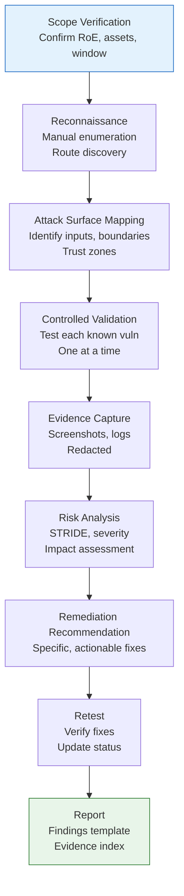

# Testing Methodology

## Overview

This document defines the testing methodology for the RabTech Academy Task 02 authorized security assessment. All testing is **manual, low-rate, controlled, non-destructive, and restricted to approved assets** per the Rules of Engagement.

---

## Testing Principles

| Principle | Application |
|-----------|-------------|
| **Authorization First** | No testing without signed RoE and approved window |
| **Minimum Necessary** | Only test what's needed to validate known vulnerabilities |
| **Non-Destructive** | No data destruction, no persistence, no service disruption |
| **Low-Rate** | Manual pace; no automation; ≤10 requests/minute sustained |
| **Evidence-Based** | Every finding requires reproducible evidence |
| **Scope-Bound** | Never test outside LAB-01 and LAB-02 |
| **Stop on Conditions** | Immediate halt on any stop condition trigger |

---

## Testing Lifecycle



---

## Phase 1: Scope Verification

**Objective**: Confirm authorization and environment before any testing.

**Activities**:
1. Review signed `docs/authorization.md`
2. Verify approved window is active
3. Confirm LAB-01 accessible at `http://127.0.0.1:8080`
4. Confirm LAB-02 reachable at `192.168.56.20` (host-only)
5. Verify no external network access from test machine
6. Document baseline environment state

**Deliverable**: Scope verification checklist (signed/dated)

---

## Phase 2: Reconnaissance

**Objective**: Manually enumerate application functionality and attack surface.

**Activities** (LAB-01):
1. Navigate all linked routes from home page
2. Document each route: method, parameters, authentication requirement
3. Inspect HTML source for hidden fields, comments, endpoints
4. Review JavaScript (if any) for client-side logic
5. Check response headers (Server, X-Powered-By, CSP, etc.)
6. Test error responses (404, 500, malformed input)

**Activities** (LAB-02):
1. Passive host discovery (ping, ARP)
2. Port scan (single SYN scan, low-rate) — **only if authorized**
3. Service banner grabbing (netcat, single connection)
4. OS fingerprinting (passive only)

**Constraints**:
- No automated crawlers/spiders
- No directory brute-forcing
- No parameter fuzzing at scale
- Rate: ~1 request per 5 seconds average

**Deliverable**: Attack surface map (routes, inputs, trust boundaries)

---

## Phase 3: Attack Surface Mapping

**Objective**: Map each input to its trust boundary and STRIDE category.

**Method**:
1. For each identified input (form field, query param, path param, header, cookie):
   - Identify receiving component
   - Identify trust boundary crossed (TB-01 through TB-05)
   - Map to STRIDE categories per `threat-model/stride-register.md`
   - Note existing mitigations (parameterized queries, etc.)

**Deliverable**: Attack surface matrix (input → boundary → STRIDE → mitigation status)

---

## Phase 4: Controlled Validation

**Objective**: Validate each deliberate vulnerability with minimal, controlled testing.

**General Rules**:
- Test **one vulnerability at a time**
- Use **minimum viable payload** (no weaponized exploits)
- Capture evidence **before and after** payload
- Reset lab state via `/reset-lab` between major tests
- Document exact steps for reproducibility

### Validation Procedures by Vulnerability

#### T-001: SQL Injection (Login)
1. Navigate to `/login`
2. Enter username: `admin' -- `, password: `anything`
3. Submit form
4. Observe: redirected to `/dashboard` as admin
5. Capture: response showing dashboard, session cookie
6. Reset lab

#### T-002: IDOR (Profile)
1. Login as `alice` / `alice123`
2. Visit `/profile/1` (admin profile)
3. Observe: admin profile + notes displayed
4. Visit `/profile/3` (bob profile)
5. Observe: bob profile + notes displayed
6. Capture: screenshots of unauthorized profiles
7. Logout

#### T-003: Reflected XSS (Search)
1. Visit `/search?q=<script>alert('XSS')</script>`
2. Observe: script executes (alert dialog)
3. Capture: screenshot of alert + URL in address bar
4. Close alert, note: no CSP block

#### T-004: Stored XSS (Comments)
1. Visit `/comments`
2. Post comment: author `test`, content `<script>alert('Stored')</script>`
3. Observe: comment appears, script executes
4. Visit `/comments` in **new private/incognito window** (simulate another user)
5. Observe: script executes for new visitor
6. Capture: screenshots from both contexts
7. Reset lab

#### T-005: Broken Admin Authorization
1. Login as `alice` / `alice123` (role: user)
2. Navigate directly to `/admin`
3. Observe: admin panel loads with all users + plaintext passwords
4. Capture: screenshot (redact passwords)
5. Logout

#### T-006: Debug Mode Disclosure
1. Visit `/profile/abc` (non-integer ID)
2. Observe: Werkzeug debug traceback with source code
3. Capture: screenshot (redact internal paths if needed)
4. Note: debugger PIN visible in console (not in response)

#### T-007: Plaintext Passwords
1. Login as `alice`, visit `/admin` (via T-005)
2. Observe: `password` column shows `admin123`, `alice123`, `bob123`
2. Alternatively: inspect `lab01.db` directly with SQLite CLI
3. Capture: redacted evidence (show column name, not values)

#### T-008: Static Session Secret
1. Inspect `app.py` line 21: `app.secret_key = "lab01-static-secret-key"`
2. Verify: secret is static string, not from environment
3. Demonstrate: use `itsdangerous` to forge session (offline, documented only)
4. Capture: source code screenshot showing secret

---

## Phase 5: Evidence Capture

**Standards**:
- **Screenshots**: PNG format, 1920x1080 max, redacted per `evidence/README.md`.
- **Logs**: Request/response pairs (curl -v output), redacted
- **Configuration**: Source code snippets, config file excerpts
- **Naming**: `evidence/FIND-YYYY-NNN-description.png`

**Redaction Checklist** (per evidence item):
- [ ] Passwords obscured
- [ ] Session cookies obscured
- [ ] CSRF tokens obscured
- [ ] Real emails obscured (training emails OK with note)
- [ ] Debugger PIN obscured
- [ ] Internal file paths obscured (if not relevant)

---

## Phase 6: Risk Analysis

**Method**: Qualitative STRIDE-based rating per `threat-model/threat-prioritization.md`

**Factors Considered**:
1. **Exploitability**: Trivial / Low / Medium / High
2. **Impact**: Critical / High / Medium / Low (CIA triad)
3. **Privilege Required**: None / Authenticated / Admin
4. **Scope**: Single user / All users / System-wide
5. **Persistence**: Transient / Persistent / Permanent

**Output**: Severity rating (Critical/High/Medium/Low) with written rationale

---

## Phase 7: Remediation Recommendation

**Requirements**:
- Specific to the root cause (not generic "improve security")
- Actionable (developer can implement directly)
- Verifiable (retest objective defined)
- Prioritized per `threat-model/threat-prioritization.md`

**Format**:
```markdown
**Current Weakness**: [Code/config description]
**Why Dangerous**: [Impact explanation]
**Secure Implementation**: [Specific fix with code example]
**Expected Improvement**: [What changes]
**Retest Objective**: [How to verify fix works]
```

---

## Phase 8: Retest

**Process**:
1. Apply remediation (in separate branch or secure-examples/)
2. Restart application
3. Re-run validation procedure from Phase 4
4. Update test status in `testing/test-results.md`
5. Document any residual risk

**Retest Criteria**:
- Original payload fails
- Equivalent payloads fail (basic bypass attempts)
- Legitimate functionality preserved
- No new vulnerabilities introduced

---

## Phase 9: Reporting

**Deliverables**:
1. Individual finding documents in `findings/` (per template)
2. Evidence index in `evidence/README.md`
3. Test results summary in `testing/test-results.md`
4. Executive summary in root `README.md` (RabTech deliverables checklist)

**Finding Template**: See `findings/finding-template.md`

**Reporting Timeline**:
- Draft findings: During/after validation phase
- Final findings: End of approved window + 24 hours
- Retest results: After remediation validation

---

## LAB-02 Testing Methodology (Supplementary)

**Note**: LAB-02 services are NOT VERIFIED. If LAB-02 testing is authorized:

1. **Passive Only** (default):
   - Ping sweep host-only subnet
   - ARP table observation
   - No active connections

2. **Active Enumeration** (if explicitly authorized):
   - Single-port SYN scan (nmap -sS -p <port> --max-rate 1)
   - Banner grab (nc -v -w 5 <ip> <port>)
   - No vulnerability exploitation

3. **Stop Conditions Apply**: Any outbound traffic from LAB-02 = immediate stop

4. **Evidence**: Network captures (pcap), service banners (redacted)

**Default Position**: LAB-02 testing is **NOT EXECUTED** unless lab owner explicitly authorizes and defines scope.