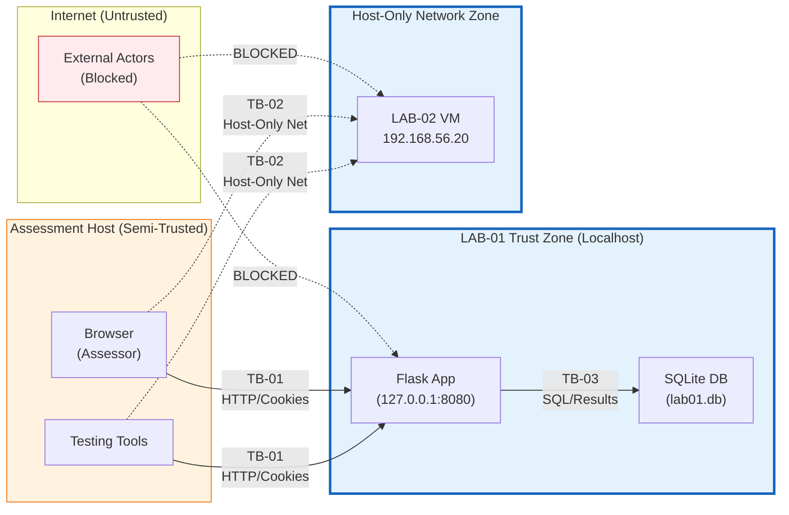

# Trust Boundaries

## Overview

This document identifies and analyzes the trust boundaries within the RabTech Academy Task 02 authorized lab environment. Trust boundaries represent transitions where data or control passes between components with different trust assumptions, privileges, or security contexts.

---

## Trust Boundary Register

| Boundary ID | Name | Source | Destination | Crossing Data/Control | Current Controls | Gaps |
|-------------|------|--------|-------------|----------------------|------------------|------|
| TB-01 | Localhost Network Boundary | Browser (Assessor) | Flask App (LAB-01) | HTTP requests, cookies, headers | OS loopback interface; Flask binds 127.0.0.1 only | None — by design for lab |
| TB-02 | Host-Only Network Boundary | Assessment Host | LAB-02 VM | Network packets (TCP/IP) | Hypervisor host-only adapter; no NAT/bridge | LAB-02 services NOT VERIFIED |
| TB-03 | Application–Database Boundary | Flask App | SQLite (lab01.db) | SQL queries, result sets | In-process SQLite connection | No parameterization in `/login`; no encryption |
| TB-04 | User Input → Application Logic | HTTP Client | Flask Request Handlers | Form data, query params, URL paths, headers | None (deliberate for training) | No validation, sanitization, encoding |
| TB-05 | Application → Privileged Function | Authenticated User | Admin Panel / Other Users' Data | Session cookie, role claim | Session check only (`if "user_id" in session`) | No role verification; no ownership check |

---

## Detailed Boundary Analysis

### TB-01: Localhost Network Boundary (Browser ↔ Flask App)

**Description**: The network boundary between the assessor's browser and the Flask application running on `127.0.0.1:8080`.

**Why It Matters**:
- This is the primary attack surface for LAB-01
- All HTTP-based vulnerabilities (SQLi, XSS, IDOR, broken authz) are exploited across this boundary
- The application binds **only** to `127.0.0.1` — not `0.0.0.0` — enforcing localhost-only access

**Current Enforcement**:
- Flask `app.run(host="127.0.0.1", port=8080)` — hardcoded in `app.py:201`
- OS network stack prevents external access to loopback interface
- No TLS/HTTPS — HTTP only (acceptable for isolated localhost lab)

**Risk If Compromised**: N/A — this boundary is the intended testing interface. Compromise means successful vulnerability validation.

**Testing Notes**: All manual testing originates here. Tools: browser, curl, Python requests.

---

### TB-02: Host-Only Network Boundary (Host ↔ LAB-02 VM)

**Description**: The virtual network boundary between the assessment host and LAB-02 VM via host-only adapter (`192.168.56.0/24`).

**Why It Matters**:
- This is the **only** network path to LAB-02
- LAB-02 has **no** internet access, no bridged networking, no NAT
- Prevents pivoting from LAB-02 to external networks
- Enforces isolation per Rules of Engagement

**Current Enforcement**:
- VirtualBox/VMware host-only network configuration
- No default gateway configured on LAB-02 (or gateway points to non-routable host-only IP)
- Firewall/routing on host prevents host-only → external forwarding

**Gaps**:
- LAB-02 services, OS, and vulnerabilities are **NOT VERIFIED**
- No network segmentation within host-only network (single flat subnet)
- No IDS/IPS monitoring on host-only traffic

**Risk If Compromised**:
- Attacker gains foothold on LAB-02
- **Stop Condition**: Any outbound traffic from LAB-02 triggers immediate test halt
- No persistence allowed — VM should be revertible to snapshot

**Testing Notes**: Passive enumeration only unless specific active tests authorized. No scanning tools that generate significant traffic.

---

### TB-03: Application–Database Boundary (Flask ↔ SQLite)

**Description**: The in-process boundary between Flask application code and the SQLite database file (`lab01.db`).

**Why It Matters**:
- All application data passes through this boundary
- SQL injection in `/login` crosses this boundary with malicious payload
- Plaintext passwords stored and retrieved here
- No encryption at rest or in transit (in-process)

**Current Enforcement**:
- SQLite parameterized queries used in **some** routes (`/profile`, `/comments` INSERT)
- **Not used** in `/login` route — string concatenation (`str.format()`)
- Database file permissions: standard file system ACLs

**Gaps**:
- `/login` uses string-built SQL — primary SQLi vector
- Passwords stored in plaintext — visible via `/admin` and direct DB access
- No column-level encryption or hashing
- No query logging or anomaly detection

**Risk If Compromised**:
- Authentication bypass (SQLi)
- Full credential disclosure (plaintext passwords)
- Data integrity loss (unauthorized INSERT/UPDATE/DELETE via SQLi)
- Session forgery via stolen credentials

**Remediation**: Parameterized queries everywhere; password hashing (bcrypt/Argon2); least-privilege DB user (not applicable to SQLite file).

---

### TB-04: User Input → Application Logic (HTTP Parameters → Handlers)

**Description**: The conceptual boundary where untrusted user-supplied data enters application processing logic.

**Why It Matters**:
- **Every** deliberate vulnerability in LAB-01 originates from insufficient controls at this boundary
- Input validation, output encoding, and sanitization are deliberately absent for training

**Vulnerable Entry Points**:
| Route | Parameter | Vulnerability | STRIDE |
|-------|-----------|---------------|--------|
| `POST /login` | `username`, `password` | SQL Injection | Tampering |
| `GET /profile/<id>` | `id` (path) | IDOR | Tampering |
| `GET /search` | `q` (query) | Reflected XSS | Information Disclosure |
| `POST /comments` | `author`, `content` | Stored XSS | Tampering / Info Disclosure |
| `GET /admin` | (session cookie) | Broken Authz | Elevation of Privilege |

**Current Controls**: None (intentional)

**Gaps**: Complete absence of:
- Input validation (type, length, format, allowlist)
- Output encoding (context-aware: HTML, JS, SQL, URL)
- Content Security Policy (CSP)
- Request validation middleware

**Risk If Compromised**: All listed vulnerabilities are exploitable.

**Remediation**: Implement validation at boundary; encode at output point; use framework protections (Flask-WTF, Jinja2 autoescape without `|safe`).

---

### TB-05: Application → Privileged Function (Session → Admin/User Data)

**Description**: The authorization boundary between an authenticated session and privileged functionality (admin panel, other users' profiles).

**Why It Matters**:
- Two critical authorization failures exist here:
  1. `/admin` checks authentication but not authorization (role)
  2. `/profile/<id>` checks authentication but not ownership
- These are **Elevation of Privilege** and **Tampering** vulnerabilities

**Current Controls**:
- Session existence check only: `if "user_id" not in session`
- Session stores `role` claim but never verifies it
- No ownership verification for profile access

**Gaps**:
- No Role-Based Access Control (RBAC) implementation
- No Resource-Based Access Control (ReBAC) / ownership checks
- No principle of least privilege enforcement
- Session `role` claim is trusted but never validated

**Risk If Compromised**:
- Any user → admin panel access (full user enumeration + plaintext passwords)
- Any user → any other user's profile/notes (IDOR)
- Horizontal and vertical privilege escalation

**Remediation**:
- Add `@require_role('admin')` decorator for `/admin`
- Add ownership check: `if target['id'] != session['user_id']: return 403`
- Implement centralized authorization middleware

---

## Trust Boundary Diagram

**SVG Diagram**: [`../diagrams/trust-boundaries.svg`](../diagrams/trust-boundaries.svg)

---

## Boundary Crossing Summary

| Crossing | Legitimate? | Validated? | Monitored? | Evidence Required |
|----------|-------------|------------|------------|-------------------|
| TB-01: Browser → Flask | Yes (testing) | N/A (lab) | Manual | Request/response logs |
| TB-02: Host → LAB-02 | Yes (testing) | NOT VERIFIED | Manual | Network captures |
| TB-03: Flask → DB (param) | Yes | Yes (some routes) | No | Query logs (if enabled) |
| TB-03: Flask → DB (raw) | **No (vuln)** | N/A | No | SQLi payload/response |
| TB-04: Input → Handler | Yes (testing) | **No (vuln)** | No | Payload/response |
| TB-05: User → Admin | **No (vuln)** | **No (vuln)** | No | Access proof |

---

## Implications for Testing

1. **TB-01 is the primary testing interface** — all LAB-01 vulnerability validation occurs here
2. **TB-02 is secondary** — LAB-02 testing limited by NOT VERIFIED status
3. **TB-03, TB-04, TB-05 are internal** — vulnerabilities manifest here but are triggered via TB-01
4. **No boundary crosses to Internet** — hard requirement per Rules of Engagement
5. **Evidence must show boundary crossing** — e.g., SQLi payload sent via TB-01, result via TB-03